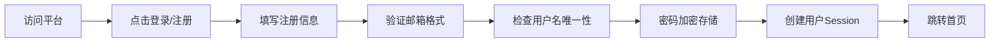
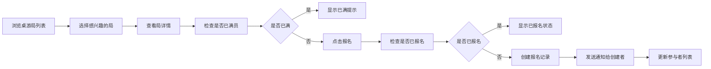
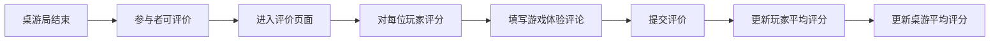

## 1. 产品概述

桌游约局与评分平台是一个专注于桌游社交的Web应用，解决桌游爱好者组局难、找同好难、评价反馈缺失的痛点。目标用户是桌游爱好者、桌游店经营者以及想要尝试桌游的新手用户。

平台的核心价值在于：
- 提供便捷的桌游组局和报名功能，降低约局门槛
- 建立玩家评价体系，帮助筛选优质玩家
- 构建桌游数据库和评分排行，帮助用户发现适合的桌游
- 记录用户游戏历史，打造桌游社交圈

## 2. 核心功能

### 2.1 用户角色

| 角色 | 注册方式 | 核心权限 |
|------|----------|----------|
| 普通用户 | 邮箱/用户名注册 | 创建/报名桌游局、评价玩家、收藏桌游、查看个人主页 |
| 管理员 | 后台账号 | 管理桌游数据库、审核违规内容、管理用户权限 |

### 2.2 功能模块

1. **首页**：导航栏、热门桌游推荐、即将开始的桌游局、功能入口
2. **桌游列表页**：桌游卡片列表、多维度筛选、搜索、排行切换
3. **桌游详情页**：桌游信息展示、规则简介、评分详情、相关推荐、收藏按钮
4. **桌游局列表页**：公开局列表、筛选（游戏类型/时间/地点/人数）、搜索
5. **桌游局详情页**：局信息展示、参与者列表、报名/取消报名、邀请链接/邀请码、评价入口
6. **创建桌游局页**：表单填写（游戏选择、时间、地点、人数、公开/私密）
7. **用户主页**：个人信息、游戏历史、收到的评价、收藏的桌游、统计数据
8. **登录/注册页**：用户认证表单
9. **评价页面**：对玩家和游戏体验的结构化评分与评论

### 2.3 页面详情

| 页面名称 | 模块名称 | 功能描述 |
|----------|----------|----------|
| 首页 | Hero区域 | 展示平台价值主张、快速行动按钮（创建局/浏览局） |
| 首页 | 热门桌游 | 展示评分最高的桌游卡片，支持横向滚动 |
| 首页 | 即将开始 | 展示即将开始的公开桌游局列表 |
| 桌游列表页 | 筛选区域 | 支持按游戏类型、玩家人数、游戏时长、难度筛选 |
| 桌游列表页 | 排行切换 | 支持按综合评分、玩家数量、热门程度排序 |
| 桌游详情页 | 评分模块 | 展示多维度评分（策略性、趣味性、互动性、运气成分） |
| 桌游详情页 | 评论区 | 用户评论列表、星级评分展示 |
| 桌游局列表页 | 筛选组件 | 按游戏类型、日期范围、距离、参与状态筛选 |
| 桌游局详情页 | 报名模块 | 显示剩余名额、报名/取消按钮、报名状态提示 |
| 桌游局详情页 | 邀请模块 | 生成分享链接和邀请码，支持复制 |
| 创建桌游局页 | 表单组件 | 支持日期选择器、地点输入、人数滑块、公开/私密开关 |
| 用户主页 | 统计面板 | 总游戏次数、总游戏时长、常用游戏类型、平均评分 |
| 用户主页 | 评价墙 | 展示其他用户对该玩家的评价 |
| 评价页面 | 评分表单 | 对每个玩家多维度评分（准时性、规则熟悉度、游戏精神）、整体评论 |
| 评价页面 | 游戏评价 | 对本次游戏体验的评分和建议 |

## 3. 核心流程

### 3.1 用户注册登录流程

### 3.2 创建桌游局流程

### 3.3 报名参加流程

### 3.4 局后评价流程

## 4. 用户界面设计

### 4.1 设计风格
- **主色调**：深紫色 (#6366F1) 作为品牌色，代表智慧和策略
- **辅助色**：琥珀色 (#F59E0B) 用于强调和行动按钮，温暖有活力
- **背景色**：深灰色背景 (#0F172A) 搭配卡片浅灰色 (#1E293B)，营造沉浸式体验
- **按钮风格**：圆角8px，有微妙的悬停动效和按压反馈
- **字体**：标题使用 Playfair Display，优雅有质感；正文使用 Inter，清晰易读
- **布局风格**：卡片式布局，层次分明，有柔和的阴影和渐变边框
- **图标风格**：使用简洁的线性图标，搭配微妙的色彩点缀

### 4.2 页面设计概览

| 页面名称 | 模块名称 | UI元素 |
|----------|----------|--------|
| 首页 | Hero区域 | 大标题采用渐变文字，背景有微妙的几何图形动效，CTA按钮有悬停缩放效果 |
| 首页 | 热门桌游 | 卡片悬停上浮，封面图有微妙的灰度滤镜，hover时恢复彩色 |
| 桌游列表页 | 筛选区域 | 标签式筛选，选中状态有背景色变化和底部边框动画 |
| 桌游详情页 | 评分模块 | 星级评分有填充动画，评分条有渐变色彩 |
| 桌游局列表页 | 列表卡片 | 左侧显示游戏封面，右侧显示时间地点和人数进度条 |
| 用户主页 | 统计面板 | 数字有滚动动画，图表采用渐变填充 |
| 创建桌游局页 | 表单 | 输入框focus时有边框色彩渐变，表单分步填写有进度指示 |

### 4.3 响应式设计
- **桌面端** (≥1024px)：三栏布局，侧边导航 + 主内容 + 右侧推荐
- **平板端** (768px-1023px)：两栏布局，顶部导航 + 主内容，筛选区改为可折叠
- **移动端** (<768px)：单栏布局，底部Tab导航，卡片占满宽度，筛选区改为下拉面板
- 所有交互元素确保48x48px最小触控区域
- 表单在移动端优化为全宽度输入

### 4.4 动画与交互
- 页面加载采用错落有致的渐入动画
- 卡片悬停有微妙的上浮和阴影加深效果
- 按钮点击有缩放反馈
- 页面切换有平滑的过渡效果
- 评分星星有逐个点亮的动画
- 数据加载采用骨架屏占位
