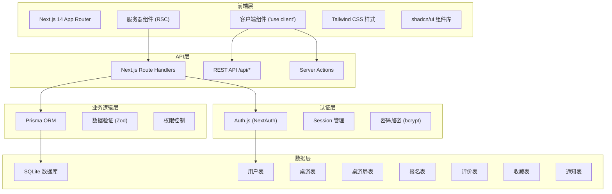
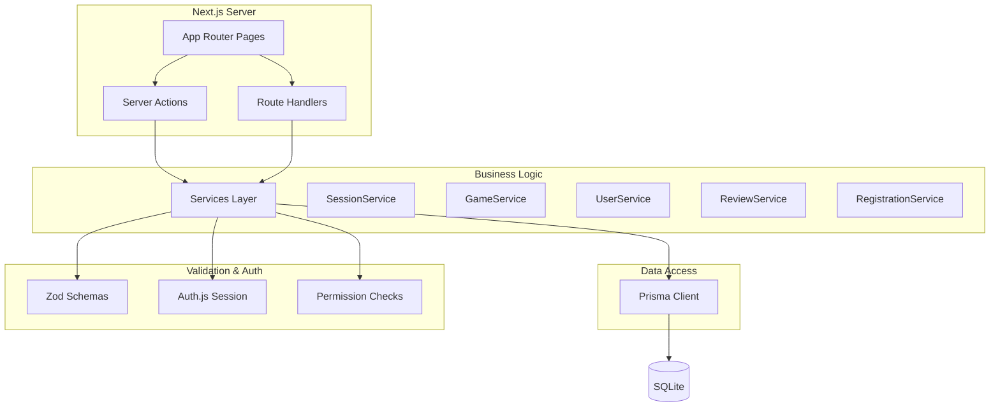
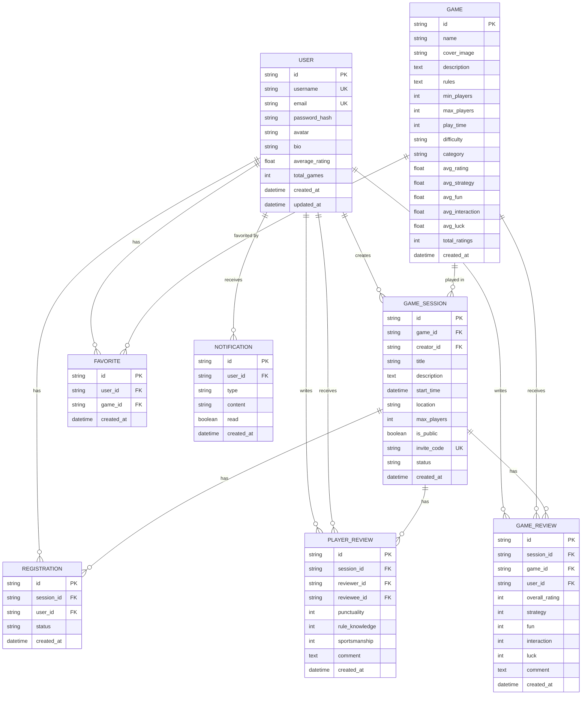

## 1. 架构设计



## 2. 技术栈说明

- **前端框架**：Next.js 14 (App Router) + React 18
- **语言**：TypeScript
- **样式方案**：Tailwind CSS 3
- **组件库**：shadcn/ui + Radix UI Primitives
- **图标**：Lucide React
- **ORM**：Prisma 5
- **数据库**：SQLite
- **认证**：Auth.js (NextAuth)
- **表单验证**：Zod + react-hook-form
- **状态管理**：React Query (TanStack Query)
- **日期处理**：date-fns
- **初始化工具**：create-next-app

## 3. 路由定义

| 路由 | 页面类型 | 功能描述 |
|------|----------|----------|
| `/` | 服务器组件 | 首页 - 热门桌游、即将开始的局 |
| `/games` | 服务器组件 | 桌游列表 - 筛选、搜索、排行 |
| `/games/[id]` | 服务器组件 | 桌游详情 - 信息、评分、评论 |
| `/sessions` | 服务器组件 | 桌游局列表 - 公开局浏览、筛选 |
| `/sessions/[id]` | 服务器组件 | 桌游局详情 - 报名、参与者、邀请 |
| `/sessions/create` | 客户端组件 | 创建桌游局 - 表单填写 |
| `/sessions/[id]/review` | 客户端组件 | 局后评价 - 玩家评分、评论 |
| `/users/[username]` | 服务器组件 | 用户主页 - 历史、评价、统计 |
| `/login` | 客户端组件 | 登录页面 |
| `/register` | 客户端组件 | 注册页面 |
| `/api/auth/*` | API路由 | Auth.js 认证接口 |
| `/api/games` | API路由 | 桌游CRUD接口 |
| `/api/sessions` | API路由 | 桌游局CRUD接口 |
| `/api/registrations` | API路由 | 报名接口 |
| `/api/reviews` | API路由 | 评价接口 |
| `/api/favorites` | API路由 | 收藏接口 |

## 4. API 定义

### 4.1 类型定义

```typescript
// 用户相关
interface User {
  id: string;
  username: string;
  email: string;
  avatar?: string;
  bio?: string;
  createdAt: Date;
  averageRating: number;
  totalGames: number;
}

// 桌游相关
interface Game {
  id: string;
  name: string;
  coverImage: string;
  description: string;
  rules: string;
  minPlayers: number;
  maxPlayers: number;
  playTime: number;
  difficulty: 'easy' | 'medium' | 'hard';
  category: string[];
  averageRating: number;
  ratings: {
    strategy: number;
    fun: number;
    interaction: number;
    luck: number;
  };
  totalRatings: number;
}

// 桌游局相关
interface GameSession {
  id: string;
  gameId: string;
  creatorId: string;
  title: string;
  description?: string;
  startTime: Date;
  location: string;
  maxPlayers: number;
  currentPlayers: number;
  isPublic: boolean;
  inviteCode: string;
  status: 'upcoming' | 'ongoing' | 'completed' | 'cancelled';
  createdAt: Date;
}

// 报名相关
interface Registration {
  id: string;
  sessionId: string;
  userId: string;
  status: 'pending' | 'approved' | 'rejected' | 'cancelled';
  createdAt: Date;
}

// 评价相关
interface PlayerReview {
  id: string;
  sessionId: string;
  reviewerId: string;
  revieweeId: string;
  punctuality: number;
  ruleKnowledge: number;
  sportsmanship: number;
  comment?: string;
  createdAt: Date;
}

interface GameReview {
  id: string;
  sessionId: string;
  gameId: string;
  userId: string;
  overallRating: number;
  strategy: number;
  fun: number;
  interaction: number;
  luck: number;
  comment?: string;
  createdAt: Date;
}
```

### 4.2 API 接口

| 方法 | 路径 | 参数 | 返回 | 权限 |
|------|------|------|------|------|
| GET | `/api/games` | `page`, `limit`, `category`, `sort` | `{ games: Game[], total: number }` | 公开 |
| GET | `/api/games/[id]` | - | `Game` | 公开 |
| POST | `/api/games` | `GameCreateInput` | `Game` | 管理员 |
| GET | `/api/sessions` | `page`, `limit`, `gameId`, `dateFrom`, `dateTo`, `status` | `{ sessions: GameSession[], total: number }` | 公开 |
| GET | `/api/sessions/[id]` | - | `GameSessionWithDetails` | 公开 |
| POST | `/api/sessions` | `SessionCreateInput` | `GameSession` | 已登录 |
| POST | `/api/sessions/[id]/join` | - | `Registration` | 已登录 |
| POST | `/api/sessions/[id]/leave` | - | `{ success: boolean }` | 已登录 |
| POST | `/api/sessions/[id]/reviews` | `ReviewSubmitInput` | `{ success: boolean }` | 参与者 |
| GET | `/api/users/[username]` | - | `UserProfile` | 公开 |
| POST | `/api/favorites` | `{ gameId: string }` | `Favorite` | 已登录 |
| DELETE | `/api/favorites/[id]` | - | `{ success: boolean }` | 已登录 |

## 5. 服务器架构



## 6. 数据模型

### 6.1 ER 图



### 6.2 Prisma Schema

```prisma
generator client {
  provider = "prisma-client-js"
}

datasource db {
  provider = "sqlite"
  url      = env("DATABASE_URL")
}

model User {
  id            String    @id @default(cuid())
  username      String    @unique
  email         String    @unique
  passwordHash  String
  avatar        String?
  bio           String?
  averageRating Float     @default(0)
  totalGames    Int       @default(0)
  createdAt     DateTime  @default(now())
  updatedAt     DateTime  @updatedAt
  
  sessions      GameSession[]
  registrations Registration[]
  reviewsGiven  PlayerReview[] @relation("Reviewer")
  reviewsReceived PlayerReview[] @relation("Reviewee")
  gameReviews   GameReview[]
  favorites     Favorite[]
  notifications Notification[]
}

model Game {
  id            String    @id @default(cuid())
  name          String
  coverImage    String
  description   String
  rules         String
  minPlayers    Int
  maxPlayers    Int
  playTime      Int
  difficulty    String
  category      String
  avgRating     Float     @default(0)
  avgStrategy   Float     @default(0)
  avgFun        Float     @default(0)
  avgInteraction Float    @default(0)
  avgLuck       Float     @default(0)
  totalRatings  Int       @default(0)
  createdAt     DateTime  @default(now())
  
  sessions      GameSession[]
  reviews       GameReview[]
  favorites     Favorite[]
}

model GameSession {
  id            String    @id @default(cuid())
  gameId        String
  creatorId     String
  title         String
  description   String?
  startTime     DateTime
  location      String
  maxPlayers    Int
  isPublic      Boolean   @default(true)
  inviteCode    String    @unique
  status        String    @default("upcoming")
  createdAt     DateTime  @default(now())
  
  game          Game      @relation(fields: [gameId], references: [id])
  creator       User      @relation(fields: [creatorId], references: [id])
  registrations Registration[]
  playerReviews PlayerReview[]
  gameReviews   GameReview[]
}

model Registration {
  id            String    @id @default(cuid())
  sessionId     String
  userId        String
  status        String    @default("approved")
  createdAt     DateTime  @default(now())
  
  session       GameSession @relation(fields: [sessionId], references: [id])
  user          User      @relation(fields: [userId], references: [id])
  
  @@unique([sessionId, userId])
}

model PlayerReview {
  id            String    @id @default(cuid())
  sessionId     String
  reviewerId    String
  revieweeId    String
  punctuality   Int
  ruleKnowledge Int
  sportsmanship Int
  comment       String?
  createdAt     DateTime  @default(now())
  
  session       GameSession @relation(fields: [sessionId], references: [id])
  reviewer      User      @relation("Reviewer", fields: [reviewerId], references: [id])
  reviewee      User      @relation("Reviewee", fields: [revieweeId], references: [id])
  
  @@unique([sessionId, reviewerId, revieweeId])
}

model GameReview {
  id            String    @id @default(cuid())
  sessionId     String
  gameId        String
  userId        String
  overallRating Int
  strategy      Int
  fun           Int
  interaction   Int
  luck          Int
  comment       String?
  createdAt     DateTime  @default(now())
  
  session       GameSession @relation(fields: [sessionId], references: [id])
  game          Game      @relation(fields: [gameId], references: [id])
  user          User      @relation(fields: [userId], references: [id])
  
  @@unique([sessionId, userId])
}

model Favorite {
  id            String    @id @default(cuid())
  userId        String
  gameId        String
  createdAt     DateTime  @default(now())
  
  user          User      @relation(fields: [userId], references: [id])
  game          Game      @relation(fields: [gameId], references: [id])
  
  @@unique([userId, gameId])
}

model Notification {
  id            String    @id @default(cuid())
  userId        String
  type          String
  content       String
  read          Boolean   @default(false)
  createdAt     DateTime  @default(now())
  
  user          User      @relation(fields: [userId], references: [id])
}
```

### 6.3 索引和初始数据

```sql
-- 为常用查询创建索引
CREATE INDEX idx_game_session_status ON GameSession(status);
CREATE INDEX idx_game_session_start_time ON GameSession(startTime);
CREATE INDEX idx_game_session_game_id ON GameSession(gameId);
CREATE INDEX idx_registration_session_id ON Registration(sessionId);
CREATE INDEX idx_registration_user_id ON Registration(userId);
CREATE INDEX idx_player_review_reviewee_id ON PlayerReview(revieweeId);
CREATE INDEX idx_game_review_game_id ON GameReview(gameId);
CREATE INDEX idx_favorite_user_id ON Favorite(userId);
CREATE INDEX idx_notification_user_id ON Notification(userId, read);

-- 初始桌游数据
INSERT INTO Game (id, name, coverImage, description, rules, minPlayers, maxPlayers, playTime, difficulty, category) VALUES
('clue001', '风声：黑名单', '/images/games/fengsheng.jpg', '一款谍战题材的身份推理桌游', '规则简介...', 3, 9, 60, 'medium', '策略,推理'),
('clue002', '三国杀', '/images/games/sanguosha.jpg', '经典国风卡牌桌游', '规则简介...', 2, 10, 45, 'medium', '卡牌,策略'),
('clue003', '璀璨宝石', '/images/games/splendor.jpg', '简单上手的宝石收集策略游戏', '规则简介...', 2, 4, 30, 'easy', '策略,经济'),
('clue004', '山屋惊魂', '/images/games/betrayal.jpg', '探索恐怖宅邸的合作/背叛游戏', '规则简介...', 3, 6, 90, 'medium', '冒险,剧情'),
('clue005', '展翅翱翔', '/images/games/wingspan.jpg', '鸟类主题的引擎构筑游戏', '规则简介...', 1, 5, 75, 'medium', '策略,引擎构筑');
```
